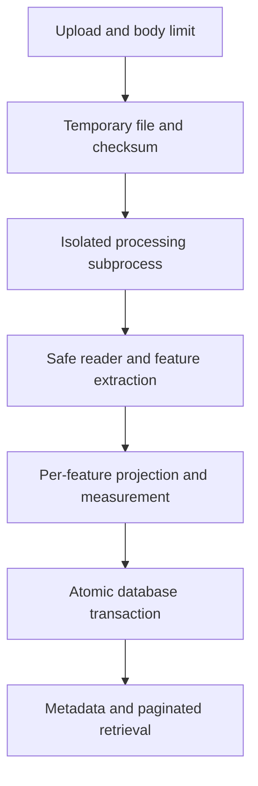

# Processing and measurement details

## Architecture

- `app/main.py`: HTTP contracts, capacity admission and persistence.
- `app/worker.py`: subprocess startup, deadline and cleanup; JSON result/error transport.
- `app/geo/readers.py`: bounded ZIP extraction, Fiona Shapefile reading and restricted KML parsing.
- `app/geo/measurement.py`: pure projection/measurement policy.
- `app/db.py`, `migrations/`: SQLAlchemy models and Alembic schema.
- `app/schemas.py`: typed responses, reflected in OpenAPI.

A fresh subprocess costs startup time, but provides a killable deadline and avoids one malformed GIS job taking down another. It communicates via temporary JSON rather than pickled custom exceptions. Uploads have independent temporary directories, always cleaned during normal error/timeout handling. Abrupt whole-host termination may leave temporary directories; a deployment should apply an age-based cleanup policy.

Database writes execute in a thread outside the event loop. One transaction inserts file and features. Unique `(file_id,index)` prevents duplicate feature indices. PostgreSQL enforces the file foreign key; SQLite development mode does not enable foreign-key enforcement. Raw uploads are discarded after processing; metadata, checksum and extracted records persist. Repeated uploads receive separate IDs. PostgreSQL JSON storage suffices because the API does not perform spatial querying; PostGIS would add no value to these endpoints.

## Projection policy

1. KML uses WGS84 longitude/latitude. Shapefile uses its projection definition, with an explicit caller override only when CRS is absent. Coordinates are never guessed from their magnitude.
2. PyProj transforms source geometry to WGS84 using `always_xy=True`, error checking and `allow_ballpark=False`. Remote grid downloading is disabled; unavailable datum operations become explicit failures.
3. Each feature receives a projected CRS centred on its longitude/latitude bounding box midpoint. Polygon/MultiPolygon uses **Lambert azimuthal equal-area**; LineString/MultiLineString uses **azimuthal equidistant**. Measurements then use Shapely in metres.
4. Geographic straight edges are densified to at most 0.01 degrees before projection, with a precomputed one-million-vertex ceiling. Multi geometries sum their parts; polygon holes subtract from area. No automatic topology repair.
5. Supported longitude and latitude spans are each at most 6 degrees. Ordinary zone/equator crossings work. Antimeridian crossings and broader features are flagged instead of returning misleading numbers.

Why not a single UTM CRS? One file can contain distant features, and zone boundaries are arbitrary for small cross-boundary surveys. Why not EPSG:3857? Its area and distance distortions are unsuitable for a general metric measurement API. Why not use ellipsoidal area alone? The assignment specifically requires a projected calculation. Independent geodesic methods are used as test references.

**Limitations:** equidistant projections preserve distance from their centre, not every arbitrary segment. Densified edges follow straight interpolation in WGS84 coordinate space, not a universal geodesic-edge or original-CRS curved-edge model. Six-degree bounding limits bound domain, not a certified error tolerance. Supplied datum accuracy, sparse geometry and survey quality affect results. The tests establish numeric tolerances for specific local fixtures, not survey-grade global guarantees. Curved geometries, mixed collections and broader extents require an expanded policy.

References: [PyProj transformations](https://pyproj4.github.io/pyproj/stable/api/transformer.html), [PROJ projections](https://proj.org/en/stable/operations/projections/index.html), [GDAL Shapefile driver](https://gdal.org/en/stable/drivers/vector/shapefile.html).

## Input handling and limits

Defaults in `Settings`: 10 MiB upload; 50 MiB expanded ZIP; 100 archive members; 10,000 features; 500,000 input vertices; 30-second processing deadline; two simultaneous processing jobs **per server process**.

The request-body guard counts actual bytes, including chunked bodies, before multipart parsing. It buffers at most upload limit plus 64 KiB of multipart overhead. This means the HTTP layer uses bounded memory rather than pretending to offer unlimited streaming. A reverse proxy/global admission policy remains necessary under large numbers of simultaneous slow clients.

ZIP rejects traversal/absolute paths, symlinks, encryption, normalized duplicate/case-colliding names and excessive expansion. Exactly one matched `.shp/.shx/.dbf` dataset is accepted, including nested folders. `.prj` is required unless CRS is explicitly supplied; `.cpg` is optional. Malformed or conflicting CRS is an error.

KML supports nested folders/documents, Placemark IDs, Point, LineString, Polygon with holes, MultiGeometry, name/description and ExtendedData. XML entities/DTDs are blocked. NetworkLink is rejected and never fetched. Unsupported gx:Track/Model returns a feature warning. It is deliberately a restricted KML reader, not a complete implementation of rendering/style/remote-resource behavior.

